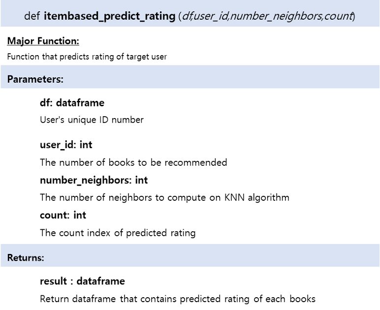
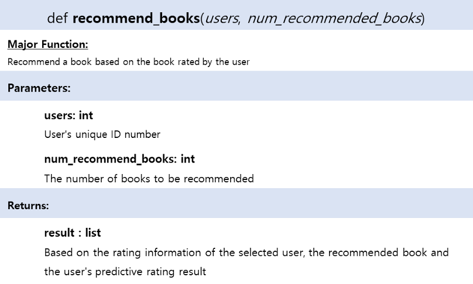
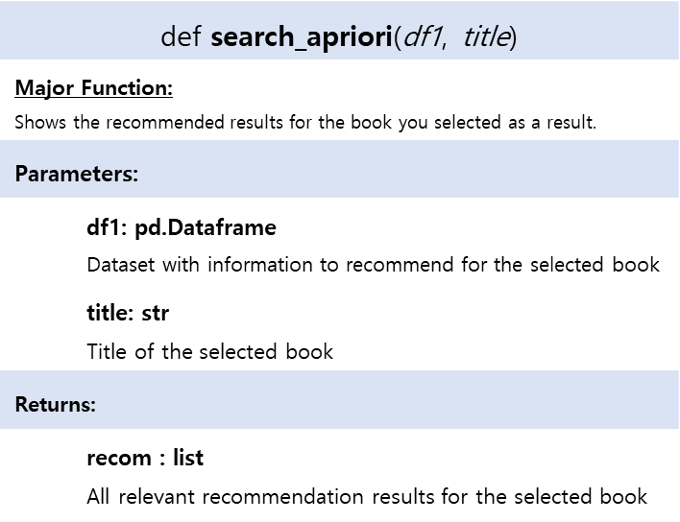
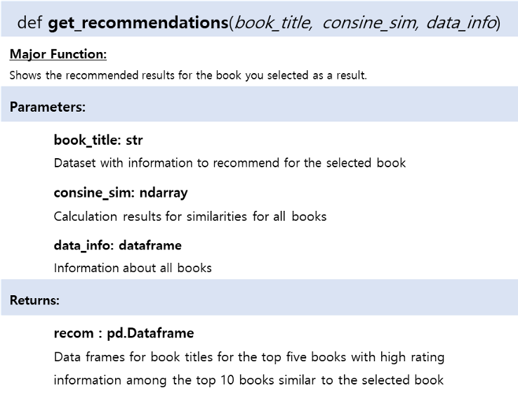
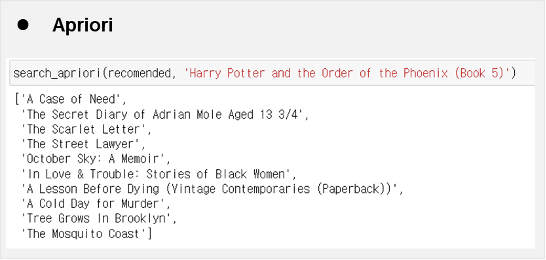
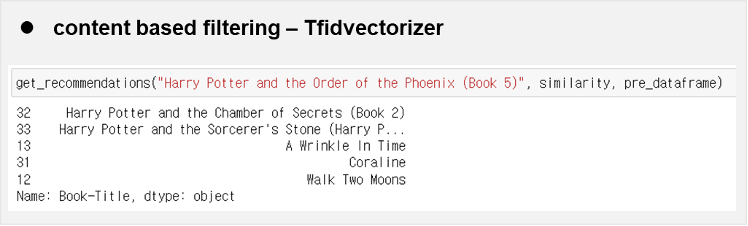
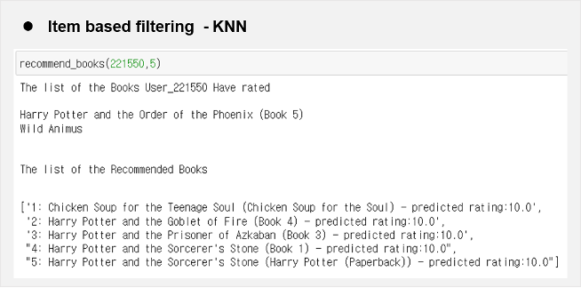

# Overview

 &nbsp; As the people easily get information through media these days, book sales rate was getting decreased so we planned to make book recommendation system using three different method that can help improve book sales.

1. Item based collaborative filtering (KNN with cosine similarity)
2. Apriori algorithm
3. Content based filtering (Vector space model)

And we compared these three method to see the difference.
    
Used Book-Crossing dataset from kaggle.

link: https://www.kaggle.com/datasets/ruchi798/bookcrossing-dataset

 

# Function documentations

- Item based filtering
    
    
    
    
    
- **Apriori**
    
    
    
- Content based filtering
    
    
    
 

# Function call examples

- Apriori 
    
    
    
- content based filtering - Tfidvectorizer
    
    
    
- Item based filtering - KNN
    
    
    
